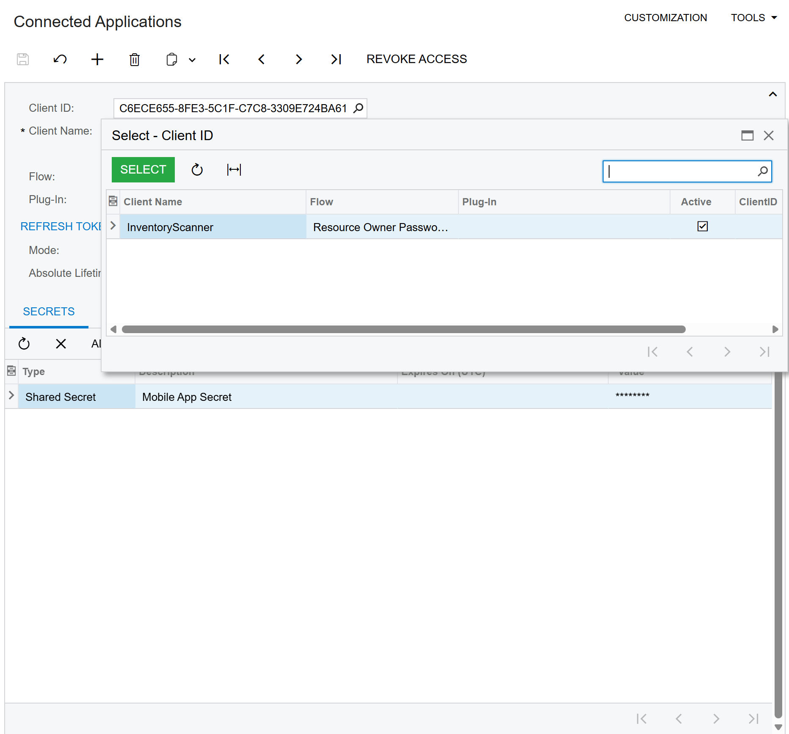
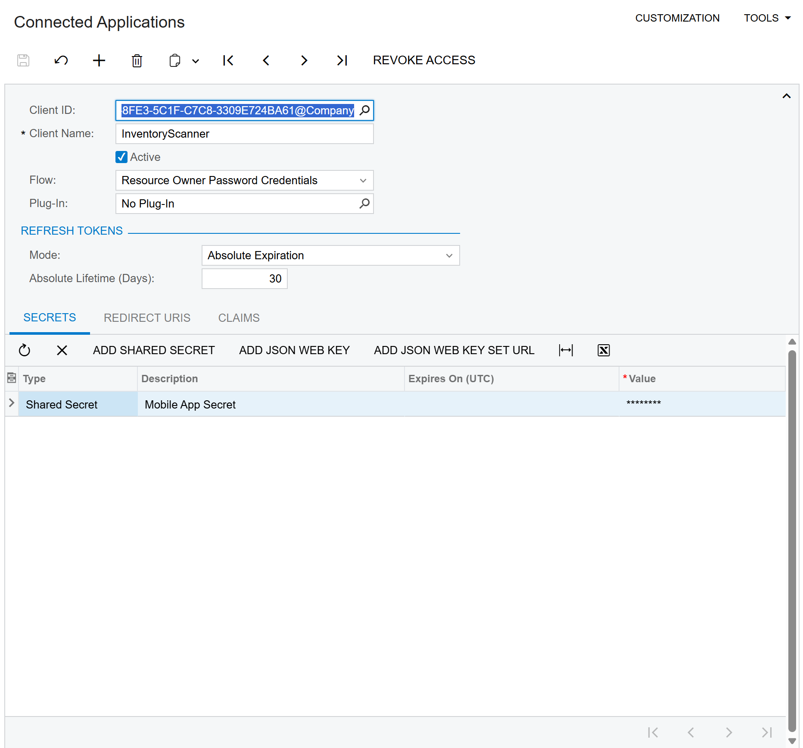
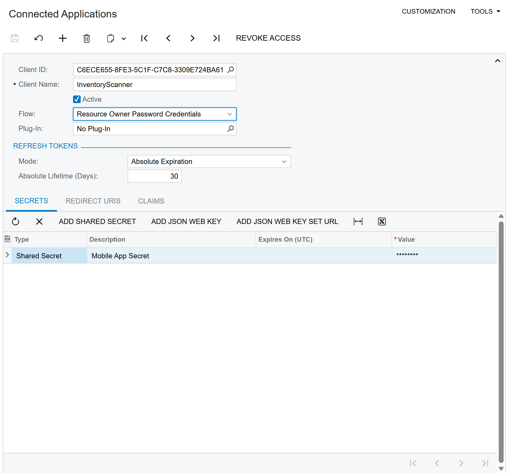

# 📦 Acumatica Inventory Scanner

Scan barcodes, fetch live Acumatica inventory, and see per-warehouse stock—manual setup today, guided onboarding coming soon.

> **Developed by [AcuPower LTD](https://acupowererp.com)** - Acumatica Implementation Experts

## ✨ Features

- 📷 **Real-time Barcode Scanning** - Fast camera-based barcode detection
- 🔍 **Inventory Lookup** - Instantly search and view stock item details
- 🔐 **OAuth 2.0 Authentication** - Secure API access to Acumatica
- 💾 **Settings Persistence** - Save credentials for quick re-login
- 🎨 **Modern Dark Theme** - Industrial-inspired UI design
- 📱 **Cross-Platform** - Works on Android and iOS

---

## 📋 Prerequisites

Before using this app, ensure you have:

1. **Acumatica ERP Instance** (version 20.2 or later)
2. **User Account** with API access permissions
3. **OAuth Connected Application** configured in Acumatica

---

## 🔧 Acumatica Configuration

### Step 1: Create an OAuth Connected Application

The app requires OAuth credentials for secure API access. Follow these steps:

1. **Navigate to Connected Applications**
   - In Acumatica, go to: **System → Integration → Connected Applications**
   - Or use the screen ID: `SM303010`

   

2. **Create New Application**
   - Click the **"+"** button to create a new record
   - Fill in the following fields:

   | Field | Value |
   |-------|-------|
   | **Client Name** | `InventoryScanner` (or your preferred name) |
   | **Active** | ✅ Checked |
   | **Flow** | `Resource Owner Password Credentials` |
   | **Plug-In** | `No Plug-In` |

   

3. **Add a Client Secret**
   - Click **"Add Shared Secret"** in the Secrets tab
   - Enter a description (e.g., "Mobile App Secret")
   - **⚠️ IMPORTANT**: Copy and save the generated secret value immediately!
     - The secret is only shown once and cannot be retrieved later
   - Click **OK** to add the secret

   

4. **Save and Note Credentials**
   - Press **Ctrl+S** to save
   - Note the following values:
     - **Client ID** (e.g., `C6ECE655-8FE3-5C1F-C7C8-3309E724BA61@Company`)
     - **Client Secret** (the value you copied in step 3)

   

---

### Step 2: Find Your API Version

The app needs to know which API version your Acumatica instance supports:

1. **Check Available Endpoints**
   - Open your browser and navigate to:
     ```
     https://your-instance.acumatica.com/YourSite/entity
     ```
   - This returns a JSON list of available API endpoints

2. **Note the Version**
   - Look for entries with `"name": "Default"`
   - Common versions: `24.200.001`, `23.200.001`, `22.200.001`
   - Use the latest version available for your instance

---

## 📱 App Configuration

### First Launch Setup

1. **Open the App**
   - Launch the Acumatica Inventory Scanner on your device

2. **Enter Connection Details**

   | Field | Description | Example |
   |-------|-------------|---------|
   | **Instance URL** | Your Acumatica site URL | `https://mycompany.acumatica.com/MySite` |
   | **Username** | Your Acumatica username | `admin` |
   | **Password** | Your Acumatica password | `****` |
   | **Tenant** | Optional - leave empty for single-tenant | |
   | **API Version** | From Step 2 above | `24.200.001` |
   | **Client ID** | OAuth Client ID from Step 1 | `GUID@Company` |
   | **Client Secret** | OAuth Secret from Step 1 | `your-secret-key` |

3. **Test Connection**
   - Tap **"Test Connection"** to verify settings
   - A green success message confirms API access

4. **Save Settings**
   - Tap **"Save Settings"** to persist for future use
   - Enable **"Remember credentials"** for auto-fill on next launch

---

## 🎯 Using the Scanner

### Scanning Barcodes

1. **Point camera at barcode** - Position within the scanning frame
2. **Hold steady** - The red scanning line indicates detection area
3. **Automatic detection** - Barcode is recognized and searched automatically

### Search Results

After scanning, the app displays:
- **Item ID** - Acumatica Inventory ID
- **Description** - Item description
- **Availability** - Current stock levels
- **Warehouse Location** - Where the item is stored

---

## ⚙️ Settings

Access settings anytime via the **Settings** tab:

### Connection Settings
- Edit Acumatica URL and credentials
- Change API version
- Update OAuth credentials

### App Preferences
- **Play sound on scan** - Audio feedback
- **Vibrate on scan** - Haptic feedback
- **Auto-search after scan** - Immediate lookup
- **Remember credentials** - Save login info

### Reset
- **Reset All Settings** - Clear all saved data and start fresh

---

## 🔒 Security Notes

1. **OAuth is Required** - Cookie-based auth is not supported for REST API
2. **Credentials Storage** - Passwords are stored in platform-secure storage
3. **Token Expiration** - OAuth tokens expire after 1 hour; re-login if needed
4. **HTTPS Only** - Always use secure connections

---

## 🐛 Troubleshooting

### "401 Unauthorized" Error
- OAuth credentials may be incorrect or expired
- Verify Client ID and Secret in Acumatica
- Check that the Connected Application is **Active**

### "404 Not Found" Error
- API version mismatch
- The endpoint uses `StockItem`, not `InventoryItem`
- Try a different API version from the `/entity` endpoint

### "Connection Failed"
- Check network connectivity
- Verify the instance URL is correct
- Ensure no VPN or firewall is blocking access

### Scanner Not Detecting
- Ensure camera permissions are granted
- Hold device steady with good lighting
- Barcode must be within the scanning frame

---

## 🏷️ Barcode Generator Utility

This repository includes a **Windows desktop application** for generating test barcodes. Located in the `BarcodeGenerator/` folder.

### Features

- Generate multiple barcode formats
- Batch generation (semicolon-separated codes)
- Customizable dimensions
- Export to PNG, JPEG, BMP, or PDF
- Real-time preview

### Supported Barcode Formats

| Format | Characters | Length Requirements | Best For |
|--------|------------|---------------------|----------|
| **Code 128** | Alphanumeric + special | Any length | ✅ Inventory IDs (recommended) |
| **QR Code** | Any text, URLs | Any length | URLs, long text |
| **Data Matrix** | Any text | Any length | Small items, high density |
| **PDF417** | Any text | Any length | Documents, IDs |
| **EAN-13** | Digits only | 12-13 digits | Retail products (worldwide) |
| **EAN-8** | Digits only | 7-8 digits | Small retail products |
| **UPC-A** | Digits only | 11-12 digits | Retail products (US/Canada) |
| **UPC-E** | Digits only | 7-8 digits | Small packages (US) |
| **ITF** | Digits only | Even number of digits | Shipping cartons |
| **Codabar** | 0-9, A-D, -, $, :, /, ., + | Any length | Libraries, blood banks |

### Barcode Format Rules

#### Alphanumeric Formats (Flexible)

**Code 128** - Most versatile, recommended for Acumatica Inventory IDs
```
✅ AALEGO500
✅ ITEM-001-A
✅ Any alphanumeric string
```

**QR Code / Data Matrix / PDF417** - Can encode any text
```
✅ https://acupowererp.com
✅ Long product descriptions
✅ Special characters: @#$%^&*
```

#### Numeric-Only Formats (Strict Rules)

**EAN-13** (European Article Number)
```
✅ 5901234123457  (13 digits)
✅ 590123412345   (12 digits - checksum auto-added)
❌ AALEGO500      (letters not allowed)
❌ 12345          (too short)
```

**EAN-8** (Short EAN)
```
✅ 96385074  (8 digits)
✅ 9638507   (7 digits - checksum auto-added)
❌ 123456789 (too long)
```

**UPC-A** (Universal Product Code - North America)
```
✅ 012345678905  (12 digits)
✅ 01234567890   (11 digits - checksum auto-added)
❌ 1234567890    (too short)
```

**UPC-E** (Compressed UPC)
```
✅ 01234565  (8 digits)
✅ 0123456   (7 digits - checksum auto-added)
❌ 012345678 (too long)
```

**ITF** (Interleaved 2 of 5)
```
✅ 1234567890  (10 digits - even count)
✅ 12345678    (8 digits - even count)
❌ 123456789   (9 digits - odd count not allowed)
```

### Usage

1. **Run the application**: Open `BarcodeGenerator.exe` or build from source
2. **Enter code(s)**: Type inventory IDs (use `;` for multiple)
   ```
   AALEGO500; WIDGET001; PART-123
   ```
3. **Select format**: Choose barcode type from dropdown
4. **Set dimensions**: Adjust width/height (default: 300×150)
5. **Generate**: Click "Generate Barcode"
6. **Save**: Export as image (PNG/JPEG/BMP) or PDF

### Integration with Mobile Scanner

Use the Barcode Generator to:
1. Create barcodes with your Acumatica Inventory IDs
2. Print them or display on screen
3. Scan with the mobile app to test the integration
4. Verify API connectivity and item lookup

### Building from Source

```bash
cd BarcodeGenerator
dotnet build
dotnet run
```

**Requirements:** .NET 8.0, Windows

---

## 📞 Support

**Created by AcuPower LTD**

- 🌐 Website: [acupowererp.com](https://acupowererp.com)
- 📧 Email: support@acupowererp.com

---

## 📄 License

This project is licensed under the **MIT License** - a permissive open source license.

You are free to:
- ✅ Use commercially
- ✅ Modify
- ✅ Distribute
- ✅ Use privately
- ✅ Sublicense

See the [LICENSE](LICENSE) file for full details.

```
MIT License
Copyright (c) 2024-2026 AcuPower LTD (https://acupowererp.com)
```

---

## 🔄 Version History

| Version | Date | Changes |
|---------|------|---------|
| 1.0.0 | 2024 | Initial release with barcode scanning |
| 1.1.0 | 2025 | Added OAuth support, Settings page |
| 1.2.0 | 2026 | Modern UI redesign, persistent settings |
